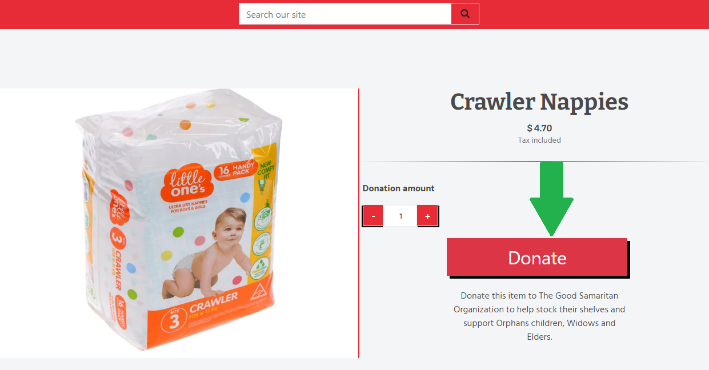
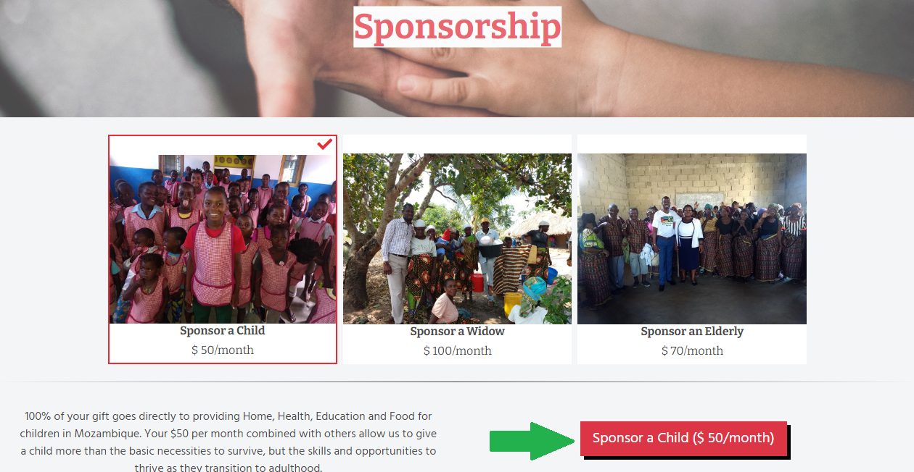
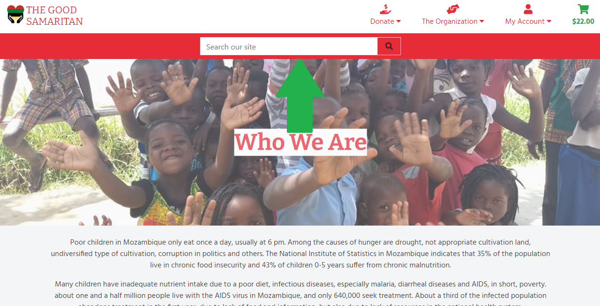

---

# The Good Samaritan Org


The Good Samaritan is a non profit organization for humanitarian support. Our target is support orphan children, widows, disabled people and elderly.
Please donate to The Good Samaritan Organization to support people in Mozambique to have a more dignified life.

Find out more about this project and help:

[Instagram](https://www.instagram.com/bomsamaritanomozambique/)

[Facebook](https://www.facebook.com/Minist%C3%A9rio-BOM-Samaritano-Mozambique-800507056757640)

[Click here to see the project live](https://good-samaritan-org.herokuapp.com/)

---

## Tables of Contents

- [Borderless](#borderless)
- [Tables of Contents](#tables-of-contents)
- [UX](#ux)
  - [The purpose of the website is to present the follow values:](#the-purpose-of-the-website-is-to-present-the-follow-values)
  - [User Stories:](#user-stories)
- [Design Process:](#design-process)
  - [Framework](#framework)
  - [Wireframing the project on Balsamiq](#wireframing-the-project-on-balsamiq)
- [Features](#features)
  - [Existing Features](#existing-features)
  - [Future Implementations](#future-implementations)
- [Technologies Used](#technologies-used)
  - [Front-End Technologies](#front-end-technologies)
  - [Back-End Technologies](#back-end-technologies)
- [Testing](#testing)
  - [Testing User Stories](#testing-user-stories)
  - [Creating an Account](#creating-an-account)
  - [Log In](#log-in)
  - [Add, Edit and Delete a Trip Post](#add-edit-and-delete-a-trip-post)
  - [Pagination](#pagination)
  - [Trip Post](#trip-post)
  - [Validating The HTML and CSS code](#validating-the-html-and-css-code)
  - [Testing in different browsers](#testing-in-different-browsers)
  - [Known Issues](#known-issues)
- [Accessibility](#accessibility)
- [Deployment](#deployment)
  - [Local Deployment](#local-deployment)
  - [Remote Deployment](#remote-deployment)
- [Cloning my project](#cloning-my-project)
- [Credits](#credits)
  - [Acknowledgements](#acknowledgements)

---

## UX

### The purpose of the website is to present the follow values:
  * Share the purpose of The Good Samaritan org in Mozambique.
  * Encourage and gain user confidence.
  * Provide multiple options of donating and help.
  * Create a resposive design, wich works in different screen sizes and devices, due the fact that people use more mobile devices nowadays.

### User Stories:

  *"As a user, I would like to _____________________________"*

  * *view the site from any device (mobile, tablet, desktop).*
  * *donate products as a guest.*
  * *donate all products at once.*
  * *sort products.*
  * *Filter products by category.*
  * *search products by name and category.*
  * *donate a parcel as a guest.*
  * *sponsor a child, widow or elderly as a guest. (recurrent donation)*
  * *view my donation in a pre checkout are like a cart or a bag*
  * *edit my donation in the cart*
  * *remove products from the cart*
  * *remove all products from the cart at once*
  * *have a secure checkout*
  * *receive an email confirming my donation after checkout*
  * *have the possibility to download a pdf with donation details after checkout*
  * *find a page where I can know more about the organization*
  * *Finish any current sponsorship as a guest*
  * *create my own account.*
  * *login with my email or user name.*
  * *login with third party account(google).*
  * *Recover any sponsorship created before create my account on my profile*
  * *view my order history on my own profile.*
  * *manage my sponsorship on my own profile. (see details and finish sponsorship)*
  * *edit my profile details.*
  * *save my profile details when checkout.*
  * *find a contact form.*
  * *be able to log out.*

Back to the [Tables of Contents](#tables-of-contents)

---  

## Design Process:

  ### Framework
  * [Bootstrap](https://getbootstrap.com/):
    * Bootstrap is a responsive mobile-first design framework with a clean and modern layout, with its simple-to-understand documentation.
  * [Jquery](https://jquery.com/):
    * In an effort to keep the JavaScript minimal, I have decided to use jQuery as foundation to my scripts framework.
  * [Django](https://www.djangoproject.com/):
    * Django is a framework that I've used to render the back-end Python with the front-end Bootstrap.
  * [Django Crispy Forms](https://django-crispy-forms.readthedocs.io/en/latest/):
    * Django-crispy-forms is an application that helps to manage Django forms. It allows adjusting forms' properties (such as method, send button or CSS classes) on the backend without having to re-write them in the template.


  ### Wireframing the project on Balsamiq
  * [Balsamiq](https://balsamiq.com/):
    * Software used to build the wireframe of this project. Because Code Institute have provided all students with free access for a limited time and the simplicity and ease of use.

  * **The wireframe can be seen here**:
    * [Wireframe](media/readme/docs/gsamaritan_wireframe.pdf)

Back to the [Tables of Contents](#tables-of-contents)

---

## Features

### Existing Features

  * This project has eighteen separate pages, which are:
    * **"Home"** page, which is the land page;
    * **"Who We Are"** page which contains the information about the organization;
    * **"FAQs"** page which contains the questions that are frequently asked to The Good Samaritan Org;
    * **"Contact Us"** page which contains a form to the user send any question to the org;
    * **"Register"** page which contains a form to the user create an account;
    * **"Log In"** page which contains a form to the user log in using email, user name or third party account (google);
    * **"Finish Sponsorship"** page which contains a form to the user finish a sponsorship as a guest;
    * **"Product Management"** page where the site owner can manage products and parcels;
    * **"Update Product or Parcel"** page which contains a form to the site owner update products or parcels details;
    * **"My Profile"** page where the user can view his donation history, current sponsorship, recover a sponsorship, edit profile details and access the Product Management page (if site owner);
    * **"Family Parcels"** page where the user can choose a parcel to donate;
    * **"Sponsorship"** page where the user can choose a sponsorship to subscribe;
    * **"Products"** page where the user can choose a product to donate;
    * **"Products Details"** page where the user can view the product details before donate;
    * **"Donation Cart"** page where the user can see all chosen products before checkout;
    * **Check Out (products, parcels or sponsorship)** page which contains a form to the user checkout the chosen donation;
    * **"Confirmation Order"** page where the user can view and download donation details after checkout;
    * **"Past Confirmation Order"** page where the user can view and download donation details of a past order in the order history;

  * **Register Account**:
    * Anybody can register for free and create their own unique account. The project has built-in authentication and authorization to check certain criteria is met before an account is validated. All passwords are hashed for security purposes.
    

  * **Log In to Account**:
    * For existing users, I have more authentication and authorization incorporated to check that the hashed passwords and username match the database, the user can log in using a third party account (google) as well.
    

  * **Log Out of Account**:
    * Users can easily log out of their account with the click of a button.
    
  
  * **Navbar**:
    * The navbar is different, depending whether the user is logged in or not. The 'My Account' Dropdown menu options will be different.
    
      * Navbar when the user is logged:
      

      * Navbar when the user is logged out:
      
  
  * **Donate as a guest**:
    * Every user logged or not can donate a product, parcel and subscribe to a sponsorship.
  
  * **Donate All Products**:
    * Button located in products page to donate all products at once, the products and total value may vary if the user sort the product list.

      
  
  * **Most-Needed Items**:
    * Button located in products page to list the most needed items, products in this list may vary.

      
  
  * **Donate Button (Products page)**:
    * Button located in products page to open the product details.

      
  
  * **Donate Button (Product Details page)**:
    * Button located in products details page to add the product to the cart.

      
  
  * **Donate Parcel Button (Products page)**:
    * Button located in products page to add the parcel to the cart.

      
   
  * **Sponsor Button**:
    * Button located in Sponsorship page to subscribe to a sponsorship, just one subscription is allowed per user or email.

      
  
  * **Profile Form**:
    * Form in the profile page to update profile details, this details are used to pre populate the checkout form and they can be updated when the user checkout a form and save details to profile.

    

  * **Donation History Column**:
    * Column in the profile page where the user can view his past donations and see the past donation details.

      
  
  * **Recover Sponsorship**:
    * Section in the profile page where the user can recover any sponsorship created as a guest, the user only can see this section if he does not created a sponsorship while logged.

      
  
  * **Sponsorship**:
    * Section in the profile page where the user can view and manage his current sponsorship, the user only can see this section if he already has a sponsorship.

      
  
  * **Product Management Button**:
    * Button located in Profile page access the Product Management page, Just the site owner can see this button.

      
  
  * **Edit Product or Parcel Button**:
    * Button to update product or parcel details, like price, name, sku and others details.

      
  
  * **Remove Product Button**:
    * Button to remove a product from database.

      
  
  * **Add New Product Button**:
    * Button to add a new product to database, Parcels can't be added, the number of parcels is fixed, they can be just edited.

      
  
  * **Update Product Quantity Button**:
    * Button located in Donation Cart page to update the quantity of a product in the cart.

      
  
  * **Remove Product Button**:
    * Button located in Donation Cart page to remove a product from cart.

      
  
  * **Remove All Items From The Cart**:
    * Button located in Donation Cart page to remove all products from cart at once.

      
  
  * **Save this information to my profile checkbox**:
    * checkbox located in checkout page to details from checkout form to profile.

      
  
  * **Top Page Search Bar**:
    * Search bar present in all pages to search any product by name or category.

      

### Future Implementations

  * Enhace automated tests.

  * Create a way of interaction between sponsor and sponsored.

  * Create an annual report page, to inform the organization improvements, events and detailed spending.

Back to the [Tables of Contents](#tables-of-contents)

---

## Technologies Used

  * [Gitpod](https://gitpod.io/)
    * Used as my primary IDE for coding. Gitpod is an open source platform for automated and ready-to-code development environments that blends into your existing workflow directly from your browser.
  
  * [GitHub](https://github.com/)
    * Used as remote storage of my code online. A company that provides hosting for software development version control using Git.

  * [Code Institute Full Template](https://github.com/Code-Institute-Org/gitpod-full-template)
    * Used as a basic template to kick start the project.

  * [Balsamiq](https://balsamiq.com/)
    * Used for wireframing the project. [see wireframe](app/static/files/readme/borderless_wireframe.pdf)

  * [draw.io](https://drawio-app.com/)
      * Used to create the database schema. [See data base schema](media/readme/docs/schema.drawio.pdf)
  
  * [Chrome Dev Tools](https://developers.google.com/web/tools/chrome-devtools)
    * A set of web developer tools built directly into the Google Chrome browser. I used these tools constantly thoughout the development cycle.
  
  * [Canva](https://www.canva.com/)
    * I used the Canva platform to make the style guide.

  * [TinyPNG](https://tinypng.com/)
    * I used TinyPNG to compress my image files to try to reduce the loading time for each page.
  
  * [W3C markup validation service](https://validator.w3.org/)
    * Great tool to support throught the web development that helps to test and find issues on markup file.

  * [CSS validation service](https://jigsaw.w3.org/css-validator/)
    * Great tool to support throught the web development that helps to test and find issues on style file.
  
  * [W3C Schools](https://www.w3schools.com/)
    * W3C Schools is a great platform that covers all aspects of web development, great tools that provides information for developers.

  * [Stack Overflow](https://stackoverflow.com/)
    * Although it isn't a technology, I found a lot of guidance on Stack Overflow.

  * [MND Web Docs](https://developer.mozilla.org/en-US/docs/Web)
    * DN Web Docs, previously Mozilla Developer Network and formerly Mozilla Developer Center, is a documentation repository for web developers used by Mozilla, Microsoft, Google, and Samsung.

  * [CSS-tricks](https://css-tricks.com/)
    * Is a blog where you can find lots of tutorial and tricks to write a good css.

Back to the [Tables of Contents](#tables-of-contents)

  ### Front-End Technologies

  * [HTML 5](https://en.wikipedia.org/wiki/HTML5)
    * Used as the base for markup text. The language used to build the structure and add its content.

  * [CSS3](https://en.wikipedia.org/wiki/CSS)
    * Used as the base for cascading styles. The language used to style the HTML5 elements according to the design and color scheme.

  * [Bootstrap framework](https://getbootstrap.com/)
    * Used as the overall design framework. I decided to use Bootstrap's grid container system as I wanted to design my project with a 'mobile first' approach, but another bootstrap resources were used like the contact form.

  * [FontAwesome](https://fontawesome.com/)
    * FontAwesome icons is where I got most part of the icons for my design project.

  * [Google Fonts](https://fonts.google.com/)
    * I used Google fonts to provide the fonts of the website.

  * [Jquery](https://jquery.com/):
    * Used as the primary JavaScript functionality. In an effort to keep the JavaScript minimal, I have decided to use jQuery as foundation to my scripts framework.

  * [Django Crispy Forms](https://django-crispy-forms.readthedocs.io/en/latest/):
    * Django-crispy-forms is an application that helps to manage Django forms. It allows adjusting forms' properties (such as method, send button or CSS classes) on the backend without having to re-write them in the template.

Back to the [Tables of Contents](#tables-of-contents)
  
  ### Back-End Technologies

  * [Django](https://www.djangoproject.com/):
    * Django is a high-level Python web framework that encourages rapid development and clean, pragmatic design.
  
  * [django-allauth](https://django-allauth.readthedocs.io/en/latest/index.html)
    * Integrated set of Django applications addressing authentication, registration, account management as well as 3rd party (social) account authentication.
  
  * [django-countries](https://pypi.org/project/django-countries/)
    * A Django application that provides country choices for use with forms, flag icons static files, and a country field for models.
  
  * [Pillow](https://pillow.readthedocs.io/en/stable/)
    * This library provides extensive file format support, an efficient internal representation, and fairly powerful image processing capabilities.
  
  * [pylint-django](https://pypi.org/project/pylint-django/)
    * pylint-django is a Pylint plugin for improving code analysis when analysing code using Django. It is also used by the Prospector tool.

  * [Cloudinary](https://cloudinary.com/)
    * Used to store products pictures

  * [Heroku](https://www.heroku.com/what)
    * Used for app hosting.
  
  * [Gunicorn - WSGI Server](https://docs.gunicorn.org/en/stable/)
    * Web Server used on Heroku for this project.
  
  * [Dj-database-url](https://pypi.org/project/dj-database-url/)
    * This simple Django utility allows you to utilize the 12factor inspired DATABASE_URL environment variable to configure your Django application.
  
  * [Dango-storages](https://django-storages.readthedocs.io/en/latest/)
    * Django-storages is a collection of custom storage backends for Django.
  
  * [Amazon Web Services (S3)](https://aws.amazon.com/)
    * S3 provides the ability to store, retrieve, access, and back up any amount of data at any time and place. Used to store static files.
  
  * [Python 3.9.6](https://www.python.org/)
    * Used as the back-end programming language.
  
  * [Stripe](https://stripe.com/ie/about)
    * Online payment and subscription API, used as UI to manage the store payments as well.
  
  * [Dj-stripe](https://dj-stripe.readthedocs.io/en/master/)
    * dj-stripe implements all of the Stripe models, for Django. Set up your webhook endpoint and start receiving model updates. You will then have a copy of all the Stripe models available in Django models, as soon as they are updated!
  
  * [xhtml2pdf](https://xhtml2pdf.readthedocs.io/en/latest/usage.html)
    * xhtml2pdf enables users to generate PDF documents from HTML content easily and with automated flow control such as pagination and keeping text together.
  
  * [Waypoints](http://imakewebthings.com/waypoints/)
    * Waypoints is the easiest way to trigger a function when you scroll to an element, used to infinite scroll.

Back to the [Tables of Contents](#tables-of-contents)

---

## Testing

### Automated Tests

* All apps are tested by django TestCase, it includes forms and views automated tests see example bellow:
    ```python
      from django.test import TestCase
      from home.forms import ContactForm


      class testContactForm(TestCase):
          """
          Test contact form

          Methods:
              *test_first_name_is_required: Test if first name field is required;
              *test_last_name_is_required: Test if last name field is required;
              *test_email_address_is_required: Test if email field is required;
              *test_email_address_is_valid: Test if email field is valid;
              *test_message_is_required: Test if message field is required;
          """
          def test_first_name_is_required(self):
              """
              Test if first name field is required
              """

              form = ContactForm({'first_name': ""})

              self.assertFalse(form.is_valid())
              self.assertIn('first_name', form.errors.keys())
              self.assertEqual(form.errors['first_name'][0],
                              'This field is required.')
    ```

* To check the test results in CLI, just run tyhe following command:
    * > python3 manage.py test

* To check the test results for a specific app in CLI, just run tyhe following command example:
    * > python3 manage.py test home.tests

* To check the test results and coverage, follow these steps:
    1. Install Coverage:
        * > pip3 install coverage

    2. For running on a django project, use this command:
        * > coverage run --source='.' manage.py test

    3. If you need to remove gathered data, execute:
        * > coverage erase
    
    4. If you want to show the results in the command line, run:
        * > coverage report
    
    5. For more readable reports:
        * > coverage html
    
    6. To check the coverage html:
        * Open the project directory tree on browser:
            * > python3 -m http.server
        * Find the "htmlcov/" item in the list and click on this.
        * Check the coverage status and click on any item in the list to see more details.

### Testing User Stories

*"As a user, I would like to _____________________________"*

* *view the site from any device (mobile, tablet, desktop).*

  * I manually tested the live project by doing the following:  
    * Using Google Developer Tools to view the project on devices with different screen sizes.
    * Asking for feedback from friends and family who opened and interacted with the project on their devices.
    

* *donate products as a guest.*
  * All visitors are able to donate products without an account.
    

* *donate all products at once.*


* *sort products.*

* *Filter products by category.*

* *search products by name and category.*

* *donate a parcel as a guest.*
* *sponsor a child, widow or elderly as a guest. (recurrent donation)*
  * All visitors are able to donate parcels or subscribe to a Sponsorship without an account.

* *view my donation in a pre checkout are like a cart or a bag*

* *edit my donation in the cart*

* *remove products from the cart*

* *remove all products from the cart at once*

* *have a secure checkout*

* *receive an email confirming my donation after checkout*

* *have the possibility to download a pdf with donation details after checkout*

* *find a page where I can know more about the organization*

* *Finish any current sponsorship as a guest*

* *create my own account.*
    I've created my own personal account. In addition to this primary account, I've tested with about 5 fake accounts in order to confirm authentication and validation worked as expected. All authentication is handled by Django-Allauth.

* *login with my email or user name.*

* *login with third party account(google).*

* *Recover any sponsorship created before create my account on my profile*

* *view my order history on my own profile.*

* *manage my sponsorship on my own profile. (see details and finish sponsorship)*

* *edit my profile details.*

* *save my profile details when checkout.*

* *find a contact form.*

* *be able to log out.*

### Validating The HTML and CSS code
  
  #### HTML

  All pages checked. All errors and warnings fixed.

  * [W3C HTML Validator](https://validator.w3.org/) - Some erros and warning were found, like:
    * Duplicated Id;
    * Section lacks heading. Consider using h2-h6 elements to add identifying headings to all sections;
    * Bad value for attribute action on element form: Must be non-empty;
    * End tag span seen, but there were open elements;
    * Unclosed element i;

    When checking the sponsorship form page the HTML validator rise the following error:
    * "Duplicate ID id_stripe_public_key."
    I still trying to find what is causing it, because I can't find this id duplicated in the HTML document.

  #### CSS3

  * [W3C CSS Validator](https://jigsaw.w3.org/css-validator/) - No error found in the style sheet.

  #### JavaScript

  * [JShint](https://jshint.com/) - "Metrics: There are 20 functions in this file. Function with the Largest function has 13 statements in it, while the median is 1. The most complex function has a cyclomatic complexity value of 5 while the median is 1."

    ##### Common warnings:

    * "'arrow function syntax (=>)' is only available in ES6 (use 'esversion: 6').";
    * "'let' is available in ES6 (use 'esversion: 6') or Mozilla JS extensions (use moz).";
    * "'const' is available in ES6 (use 'esversion: 6') or Mozilla JS extensions (use moz).";
    * "'template literal syntax' is only available in ES6 (use 'esversion: 6')."
    * This code works well despite these warnings

    ##### One undefined variables:

    * '$' - This is for jQuery, is a sign to define/access jQuery;

* [JSesprima](https://esprima.org/demo/validate.html) - "Code is syntactically valid."

### Testing in different browsers

I manually tested the website on the following web browsers, checking buttons, responsiveness and design worked as planned:

  * Google Chrome
  * Mozilla Firefox
  * Microsoft Edge

<!-- ### Known Issues

  1. The Unfollow button in public profile page, when clicked all code related to remove user from the specific field in the database works well and the button UI turn to a Follow Button, but it does not behave as a Follow button unless the page is reloaded.

  2. In case an user is logged with two pages opened in different tabs and one of theses pages is the profile page, if the user log out in the tab that isn't the profile and after try to reload the profile page, then he would see a KeyError error, because there is no longer any session called 'user'. This error was fixed adding a try/except statement in every page that needs a user logged to be used, if there is no longer session 'user', then redirect to feed page, which does not need the session 'user'.

  3. If a user create a trip where the place name does not exists in the country, the google maps is not rendered.

  4. Unfollow link in Following tab (profile page) and Remove Follower in the Followers tab (profile page), just work with a double click.

  5. ~~Icons from google maps are not rendering.~~ Fixed adding 'data:' data scheme to content security policy.

  6. ~~Pictures in preview photos in edit trip page are not redering~~ Fixed adding 'blob:' data scheme to content security policy

Back to the [Tables of Contents](#tables-of-contents) -->

---

## Accessibility

  * Each image has an alt attribute describing the image's function
  * Each anchor tag has an aria-label attribute describing where that link goes
  * Each section has an aria-labelledby attribute
  * Content has a contrast with the background to improve the visibility
  * Form inputs have labels

Back to the [Tables of Contents](#tables-of-contents)
---

## Deployment

### Local Deployment

Please note - in order to run this project locally on your own system, you will need the following installed:
  * [Python3](https://www.python.org/downloads/) to run the application.
  * [PIP](https://pip.pypa.io/en/stable/installation/) to install all app requirements.
  * Any IDE such as [Microsoft Visual Studio Code](https://code.visualstudio.com/).
  * [GIT](https://www.atlassian.com/git/tutorials/install-git) for cloning and version control.
  * [Microsoft Visual Studio Code](https://code.visualstudio.com/) (or any suitable IDE) to develop your project.

Next, there's a series of steps to take in order to proceed with local deployment:

  * Clone this GitHub repository by either clicking the green Clone or download button and downloading the project as a zip-file (remember to unzip it first), or by entering the following into the Git CLI terminal:
    * > git clone https://github.com/SanclerZanella/good_samaritan_org.git

  * Navigate to the correct file location after unpacking the files.
    * > cd <path to folder>
  
  * Create an env.py file with your credentials. An example can be found [here](env_sample.py).
  
  * Install all requirements from the [requirements.txt](requirements.txt) file using this command:
    * > sudo -H pip3 -r requirements.txt

  * [Database Schema](app/static/files/readme/NoSQL_Schema.pdf)

  * In the IDE terminal, use the following command to launch the Django project:
   * > python3 manage.py runserver

  * The Django server should be running locally now on http://127.0.0.1:8000/ (or similar). If it doesn't automatically open, you can copy/paste it into your browser of choice.

  * When you run the Django server for the first time, it should create a new SQLite3 database file: db.sqlite3

  * Next, you'll need to make migrations to create the database schema:
    * > python3 manage.py makemigrations
    * > python3 manage.py migrate
  
  * In order to access the Django Admin Panel, you must generate a superuser:
    * > python3 manage.py createsuperuser
    * (assign an admin username, email, and secure password)

Back to the [Tables of Contents](#tables-of-contents)

### Remote Deployment

This site is currently deployed on [Heroku](https://signup.heroku.com/) using the main branch on GitHub. To implement this project on Heroku, the following steps were taken:

1. Create a requirements.txt file so Heroku can install the required dependencies to run the app.
    * > pip3 freeze --local > requirements.txt
    * My file can be found [here](requirements.txt).

2. Create a Procfile to tell Heroku what type of application is being deployed, and how to run it.
    * > echo web: gunicorn good_samaritan.wsgi:application > project/Procfile
    * My file can be found [here](Procfile).

3. Sign up for a free Heroku account, create your project app, and click the Deploy tab, at which point you can Connect GitHub as the Deployment Method, and select Enable Automatic Deployment.

4. In the Heroku Resources tab, navigate to the Add-Ons section and search for Heroku Postgres. Make sure to select the free Hobby level. This will allow you to have a remote database instead of using the local sqlite3 database, and can be found in the Settings tab.

5. In the Heroku Settings tab, click on the Reveal Config Vars button to configure environmental, but please omit the development=1 variable; this is only for local deployment. variables as follows:
    * DJANGO_SECRET: <Your_Django_Secret>
    * STRIPE_PUBLIC_KEY: <Your_Stripe_Public_Key>
    * STRIPE_SECRET_KEY: <Your_Stripe_Client_Secret>
    * STRIPE_WH_SECRET: <Your_Stripe_Webhook_Secret>
    * EMAIL_HOST_PASS: <Your_email_host_password>
    * EMAIL_HOST_USER: <email>
    * AWS_ACCESS_KEY_ID: <From_downloaded_amazon_CSV_file>
    * AWS_SECRET_ACCESS_KEY: <From_downloaded_amazon_CSV_file>
    * USE_AWS: <True>
    * DATABASE_URL: <Postgres_db_url>

* Your app should be successfully deployed to Heroku at this point.

6. In the project environment install "dj-database-url" and "psycopg2-binary":
    * > pip3 install dj-database-url
    * > pip install psycopg2-binary

7. Import dj_database_url in settings.py:
  * > Import dj_database_url

8. Copy and paste the default DATABASES variable and comment one of these variable.

9. In heroku config var at settings tab, copy the DATABASE_URL and paste in the env.py to use
in the default "DATABASES" configuration;

10. Set the default "DATABASES" configuration for production dj_database_url.parse() and save:
  ```python
   # DATABASES = {
                # 'default': {
                    # 'ENGINE': 'django.db.backends.sqlite3',
                    # 'NAME': BASE_DIR / 'db.sqlite3',
                # }
    
    DATABASE_URL = os.environ.get('DATABASE_URL', '')
    DATABASES = {
        'default': dj_database_url.parse(DATABASE_URL)
    }
  ```

10. Close any connection on CLI typing "ctrl + c" on CLI and Migrate database:
    * > python3 manage.py migrate

11. Load database objects:
    * If you have Fixtures, you will need to load each fixture at a time, for this project will be
  for categories fixture, products fixture and after for parcel fixture:
      * > python3 manage.py loaddata categories
      * > python3 manage.py loaddata products
      * > python3 manage.py loaddata parcels
    * If you don't have fixtures in your project, you can download your local mysql database and upload it to postgres:
      * Make sure your manage.py file is connected to your mysql database:
        ```python
          DATABASES = {
                        'default': {
                            'ENGINE': 'django.db.backends.sqlite3',
                            'NAME': BASE_DIR / 'db.sqlite3',
                        }
        ```
      * Use this command to backup your current database and load it into a db.json file:
          * > python3 manage.py dumpdata --exclude auth.permission --exclude contenttypes > db.json
      * Connect your manage.py file to your postgres database:
        ```python
          # DATABASES = {
                      # 'default': {
                          # 'ENGINE': 'django.db.backends.sqlite3',
                          # 'NAME': BASE_DIR / 'db.sqlite3',
                      # }
          
          DATABASE_URL = os.environ.get('DATABASE_URL', '')
          DATABASES = {
              'default': dj_database_url.parse(DATABASE_URL)
          }
        ```
      * Then use this command to load your data from the db.json file into postgres:
          * > python3 manage.py loaddata db.json

12. Setup the default database to postgres in production environment:
    ```python3
      if 'DATABASE_URL' in os.environ:
          DATABASE_URL = os.environ.get('DATABASE_URL', '')
          DATABASES = {
              'default': dj_database_url.parse(DATABASE_URL)
          }
      else:
          DATABASES = {
              'default': {
                  'ENGINE': 'django.db.backends.sqlite3',
                  'NAME': BASE_DIR / 'db.sqlite3',
              }
          }
    ```

13. Install gunicorn:
    * > pip3 install gunicorn
14. Login to heroku on CLI:
    * > heroku login -i
15. Temporarily disable collectstatic:
    * > heroku config:set DISABLE_COLLECTSTATIC=1 --app good-samaritan-org
16. Add the heroku app to ALLOWED_HOSTS in settings.py
    ```python
        ALLOWED_HOSTS = ['good-samaritan-org.herokuapp.com', 'localhost']
    ```
17. Initialize Heroku git remote:
    * > heroku git:remote -a good-samaritan-org

18. If you didn't setup the automatic deployment, then Push repository to heroku via CLI:
    * > git push heroku main

19. If you didn't setup the automatic deployment, then it's a good time to setup it.
    * On deploy tab in heroku dashboard, choose github as Deployment method, look for the repository name (good_samaritan_org) and connect.
    * In the same tab, enable automatically deploys.

20. Create an AWS account.

21. Choose the S3 service in the services menu.

22. Create a new bucket, unset "Block all public access" option and set "Turning off block all public access might result in this bucket and the objects within becoming public" option.

23. In the bucket configuration, at the properties tab edit and enable the Static website hosting.

24. As index document use index.html and as Error document error.html, then save changes.

25. At the permission tabs edit Cross-origin resource sharing (CORS), Paste the CORS configuration, then save:
    ```javascript
      [
        {
          "AllowedHeaders": [
            "Authorization"
          ],
          "AllowedMethods": [
            "GET"
          ],
          "AllowedOrigins": [
            "*"
          ],
          "ExposeHeaders": []
        }
      ]
    ```

26. Then edit the Bucket policy, click on AWS Policy Generator.
    * Select Type of Policy: S3 Bucket Policy
    * Effect: Allow
    * Principal: *
    * Actions: getObject
    * Past the Amazon Resource Name (ARN)
    * click add statement
    * Then generate policy and copy

27. Paste in the Bucket policy, add a "/*" to the end of resource field  ("arn:aws:s3:::good-samaritan-org/*") and save.

28. Edit access control list (ACL).

29. Set Everyone (public access): list, then save.

30. In the Services menu, open the IAM.

31. Click in User groups, then click create group.

32. Click in Policies and then create policies.

33. On Json tab click import managed policy.

34. Search for s3 and import the AmazonS3FullAccess.

35. In the Json tab change de "Resource" field content to and Then click review policy: 
    ```javascript
      [
        "arn:aws:s3:::good-samaritan-org",
        "arn:aws:s3:::good-samaritan-org/*"
      ]
    ```

36. Give a name and a description, then click create policies.

37. In the User Groups tab open your new created group.

38. In the permission tab click add permissions and attach policies.

39. Select the new created policy and click add permission, after click on Users, then click add user.

40. Give a name, set Programmatic access, click "next: permissions" and set new created attached policy, then create user

41. Download the CSV file (Don't leave this screen without download this file, you won't have another chance!)

42. On project environment, install boto3 and django-storages:
    * > pip3 install boto3
    * > pip3 install django-storages

43. Add 'storages' to INSTALLED_APPS in settings.py.

44. Add, in settings.py, the variables AWS_STORAGE_BUCKET_NAME, AWS_STORAGE_BUCKET_NAME, AWS_ACCESS_KEY_ID and AWS_SECRET_ACCESS_KEY:
    ```python
      if 'USE_AWS' in os.environ:
        AWS_STORAGE_BUCKET_NAME = 'good-samaritan-org'
        AWS_S3_REGION_NAME = 'eu-west-1'
        AWS_ACCESS_KEY_ID = os.environ.get('AWS_ACCESS_KEY_ID')
        AWS_SECRET_ACCESS_KEY = os.environ.get('AWS_SECRET_ACCESS_KEY')
    ```

45. In heroku settings tab, add the AWS_ACCESS_KEY_ID  and AWS_SECRET_ACCESS_KEY to Config Vars.

46. Remove DISABLE_COLLECTSTATIC variable from Config Vars in heroku.

47. Add AWS_S3_CUSTOM_DOMAIN variable to settings.py:
    ```python
      if 'USE_AWS' in os.environ:
      AWS_STORAGE_BUCKET_NAME = 'good-samaritan-org'
      AWS_S3_REGION_NAME = 'eu-west-1'
      AWS_ACCESS_KEY_ID = os.environ.get('AWS_ACCESS_KEY_ID')
      AWS_SECRET_ACCESS_KEY = os.environ.get('AWS_SECRET_ACCESS_KEY')
      AWS_S3_CUSTOM_DOMAIN = f'{AWS_STORAGE_BUCKET_NAME}.s3.amazonaws.com'
    ```

48. Create a [custom_storages.py](custom_storages.py) file on root directory.

49. In the settings.py add STATICFILES_STORAGE, STATICFILES_LOCATION, DEFAULT_FILE_STORAGE, MEDIAFILES_LOCATION variables:
    ```python
      if 'USE_AWS' in os.environ:
        # Bucket config
        AWS_STORAGE_BUCKET_NAME = 'good-samaritan-org'
        AWS_S3_REGION_NAME = 'eu-west-1'
        AWS_ACCESS_KEY_ID = os.environ.get('AWS_ACCESS_KEY_ID')
        AWS_SECRET_ACCESS_KEY = os.environ.get('AWS_SECRET_ACCESS_KEY')
        AWS_S3_CUSTOM_DOMAIN = f'{AWS_STORAGE_BUCKET_NAME}.s3.amazonaws.com'

        # Static and media files
        STATICFILES_STORAGE = 'custom_storages.StaticStorage'
        STATICFILES_LOCATION = 'static'
        DEFAULT_FILE_STORAGE = 'custom_storages.MediaStorage'
        MEDIAFILES_LOCATION = 'media'
    ```

50. Then Override static and media URLs in production:
    ```python
      if 'USE_AWS' in os.environ:
        # Bucket config
        AWS_STORAGE_BUCKET_NAME = 'good-samaritan-org'
        AWS_S3_REGION_NAME = 'eu-west-1'
        AWS_ACCESS_KEY_ID = os.environ.get('AWS_ACCESS_KEY_ID')
        AWS_SECRET_ACCESS_KEY = os.environ.get('AWS_SECRET_ACCESS_KEY')
        AWS_S3_CUSTOM_DOMAIN = f'{AWS_STORAGE_BUCKET_NAME}.s3.amazonaws.com'

        # Static and media files
        STATICFILES_STORAGE = 'custom_storages.StaticStorage'
        STATICFILES_LOCATION = 'static'
        DEFAULT_FILE_STORAGE = 'custom_storages.MediaStorage'
        MEDIAFILES_LOCATION = 'media'
        
        # Override static and media URLs in production
        STATIC_URL = f'https://{AWS_S3_CUSTOM_DOMAIN}/{STATICFILES_LOCATION}/'
        MEDIA_URL = f'https://{AWS_S3_CUSTOM_DOMAIN}/{MEDIAFILES_LOCATION}/'
    ```

51. Add to settings.py the AWS_S3_OBJECT_PARAMETERS:
    ```python
      if 'USE_AWS' in os.environ:
        # Cache control
        AWS_S3_OBJECT_PARAMETERS = {
            'Expires': 'Thu, 31 Dec 2099 20:00:00 GMT',
            'CacheControl': 'max-age=94608000',
        }

        # Bucket config
        AWS_STORAGE_BUCKET_NAME = 'good-samaritan-org'
        AWS_S3_REGION_NAME = 'eu-west-1'
        AWS_ACCESS_KEY_ID = os.environ.get('AWS_ACCESS_KEY_ID')
        AWS_SECRET_ACCESS_KEY = os.environ.get('AWS_SECRET_ACCESS_KEY')
        AWS_S3_CUSTOM_DOMAIN = f'{AWS_STORAGE_BUCKET_NAME}.s3.amazonaws.com'

        # Static and media files
        STATICFILES_STORAGE = 'custom_storages.StaticStorage'
        STATICFILES_LOCATION = 'static'
        DEFAULT_FILE_STORAGE = 'custom_storages.MediaStorage'
        MEDIAFILES_LOCATION = 'media'
        
        # Override static and media URLs in production
        STATIC_URL = f'https://{AWS_S3_CUSTOM_DOMAIN}/{STATICFILES_LOCATION}/'
        MEDIA_URL = f'https://{AWS_S3_CUSTOM_DOMAIN}/{MEDIAFILES_LOCATION}/'
    ```

52. In the s3 bucket interface, create a media folder and upload all media files.

53. Confirm the email of the new superuser trying to login or direct on admin interface.

54. Change stripe webhook endpoint.

55. In the Admin interface, setup the most-need products in Products table.

56. Change the domain name in Sites table.

57. Add the Google API to Social Applications table if you're using the google account to log in.

---

## Cloning a Repository

If you would like to work on my project further you can clone it to your local machine using the following steps:

  1. Scroll to the top of my repository and click on the "clone or download button"
  2. Decide whether you want to clone the project using HTTPS or an SSH key and do the following:
    * HTTPS: click on the checklist icon to the right of the URL
    * SSH key: first click on 'Use SSH' then click on the same icon as above
  3. Open the 'Terminal'
  4. Change the current working directory to the location where you want the cloned directory
  5. Type 'git clone', and then paste the URL you copied earlier.
  6. Press 'Enter' to create your local clone.

You can find both the source of this information and learn more about the process on the following link: [Cloning a Repository](https://docs.github.com/en/github/creating-cloning-and-archiving-repositories/cloning-a-repository)

Back to the [Tables of Contents](#tables-of-contents)

---

## Credits

### Acknowledgements

Thank you to the following people who helped with support, inspiration and guidance at different stages in the project:

  * My mentor [Caleb Mbakwe](https://www.linkedin.com/in/calebmbakwe/?originalSubdomain=ng)
  * Code Institute Mentors and Tutors.
  * Code Institute Student Care, which is always Kind.
  * My class on slack.
  * The supportive Code Institute community on Slack.
  * My family and friends for their patience and honest critique throughout.
